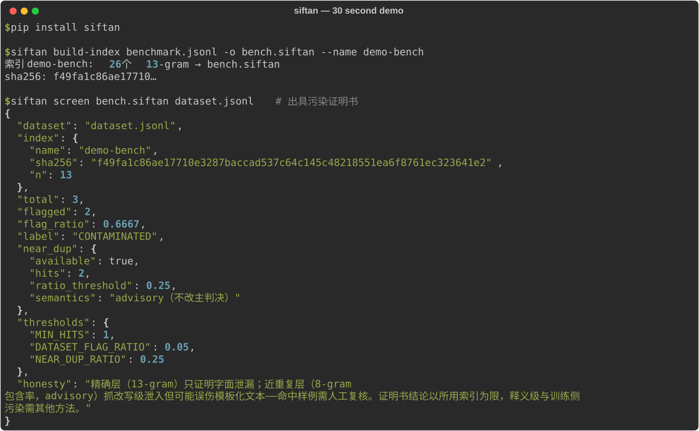

# The Sieve Beneath the Stars — Siftan

[简体中文](README.md) · English

**Siftan** screens language-model training or fine-tuning data for overlap with known evaluation benchmarks. It builds portable, verifiable n-gram indexes and reports matches with the parameters and index hash needed to reproduce a scan.

[](https://pypi.org/project/siftan/)
[](https://pypi.org/project/siftan/)
[](https://github.com/cloudydreamland/TheSieveBeneathTheStars/actions/workflows/ci.yml)
[](LICENSE)


## Quick start

```bash
python -m pip install siftan
```

Or install from source (latest development version):

```bash
git clone https://github.com/cloudydreamland/TheSieveBeneathTheStars.git
cd TheSieveBeneathTheStars
python -m pip install .
```

Python API:

```python
from siftan import build_index, screen

index = build_index(benchmark_texts, name="benchmark-v1")
certificate = screen("training-set", records, index)
print(certificate.label, certificate.flag_ratio, certificate.index_sha256)
```

## What is checked

- Exact character n-gram overlap after documented Unicode and whitespace normalization.
- An advisory near-duplicate signal for some edits that preserve longer text spans.
- Portable indexes with schema and content hashes that can be verified independently.
- A machine-readable screening result with index identity and screening parameters.

## Read the result carefully

`CLEAN` means this scan did not find a match against the supplied index using the selected rules. It does not prove a dataset is free of benchmark contamination. The near-duplicate signal is advisory and can require human review. Structural paraphrases, translations, and fragments shorter than the configured overlap signal may not be detected. Build indexes only from datasets whose license permits your intended use.

## Documentation

- [简体中文](README.md)
- [Changelog](CHANGELOG.md)
- [Roadmap](ROADMAP.md)
- [Research and comparison notes](GAP_PROOF.md)

## Development and security

See [CONTRIBUTING.md](CONTRIBUTING.md). Please report security issues privately; see [SECURITY.md](SECURITY.md).

## Feedback and contributing

Use [Discussions](https://github.com/cloudydreamland/TheSieveBeneathTheStars/discussions) for questions and ideas, and [Issues](https://github.com/cloudydreamland/TheSieveBeneathTheStars/issues) for reproducible bugs. Share only synthetic or redacted minimal examples; never upload personal data, API keys, or private source text. Report security issues privately as described in [SECURITY.md](SECURITY.md).

## License

MIT. See [LICENSE](LICENSE).
